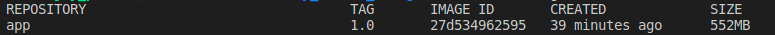
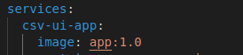
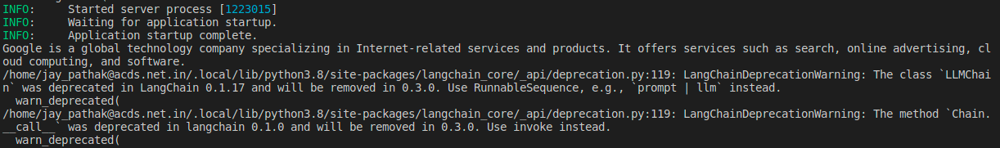
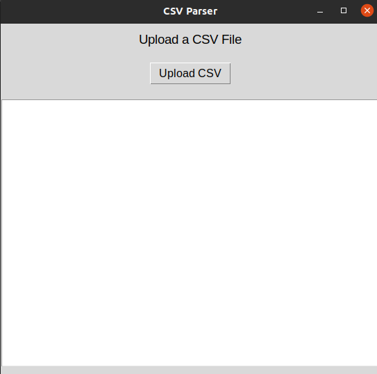
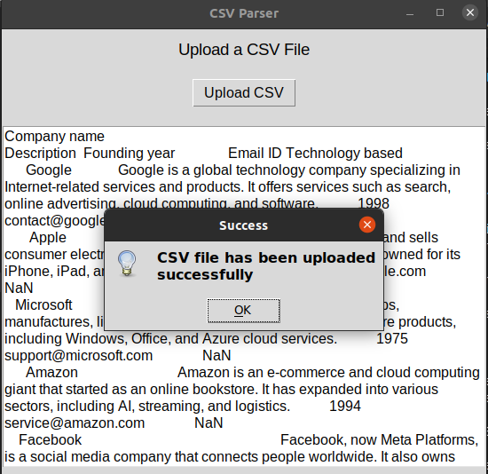
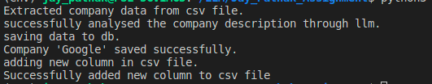

# How to run the application

## Folder Structure

Jay_Pathak_Assignment/ <br />
├── llm_code_to_check_description <br />
│ ├── check_company_desc.py <br />
│ ├── imports.py <br />
│ └── main.py <br />
| └── schemas.py <br />
├── saving_data_to_sql <br />
│ ├── saving_company_data.py <br />
│ ├── query_script.py <br />
├── upload_csv_file<br />
│ ├── csv_input_tkinter.py <br />
├── company_data.csv <br />
├── Dockerfile <br />
├── docker-compose.yml <br />
├── run_app.py <br />
├── run_script.py <br />
├── README.md <br />
└── requirements.txt<br />

> ## NOTE: Following commands has been used for Ubuntu.

# Run application using docker

## Prerequisites

1. docker 
2. Install X Server (if not already installed) on the Host Machine
3. Allow Access to the X Server. By default, the X server may not allow connections from containers.
   Fire command 
   ```
   xhost +local:docker
   ```
   This command allows any container running on the local machine to connect to the X server. 
   To revert this, fire command 
   ```
   xhost -local:docker
   ```

## Build docker image

1. Navigate to the folder **Jay_Pathak_Assignment**.
2. Fire below command

```
docker build -t app:1.0 .
```
In above command, app:1.0 is the image name and tag.

3. Once the command execution is successful, one can see the built image using command
```
docker images
```



## Configure docker compose file

1. Navigate to the folder **Jay_Pathak_Assignment**.
2. open *docker-compose.yml* file.
3. In front **Image**, give the name of created image with tag

    

## Steps to run the docker compose file to create docker container

1. Navigate to the folder **Jay_Pathak_Assignment**.
2. Fire command ( depends on docker verison )
```
docker-compose up
```
3. Once the command fired successfully, it should create a container and will show the log in terminal if not running in detached mode as above. **docker-compose up -d**
Instead of recreating, it must say **creating <conatiner-name>**, if it is creating for the first time.

# Run application without Docker

## Create a python virtual environment 
<br />

1. Open the terminal and fire command.
```
python3 -m venv <venv-name>
```
2. Activate the virtual env
```
source <venv-name>/bin/activate
```
3. To deactivate the venv, use command
```
deactivate
```

## Installing required packages in virtual environment.

Open terminal inside the project folder and fire command
```
pip install -r requirements.txt
```

## Running fast api app to expose api

1. Navigate inside folder **llm_code_to_check_description**.
2. Open terminal and fire command
```
uvicorn main:app --reload
```
3. This should expose an api to send data to llm.

    

## Run the main application.

1. Move to the root folder **Jay_Pathak_Assignment**.
2. Fire below python command
```
python3 run_app.py 
```
3. After firing the command, app will show a pop up window to upload a csv file.

    

4. Select csv file to be upload.
5. Once the csv file has been uploaded, you should see a pop up message that says "csv file has been uploaded successfully".

    

6. Click on save.
7. Now, inside the terminal, you can see the logs of the application.

    


